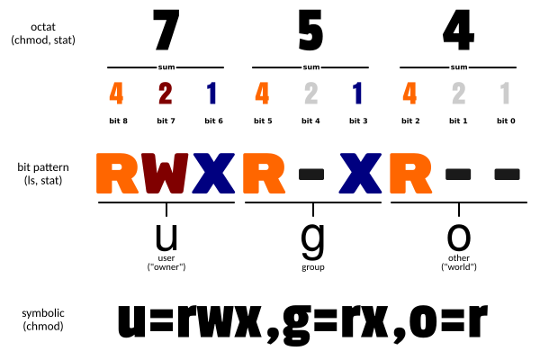

# Chmod

change mode，控制用户对文件的权限

## 语法

```
chmod [-cfvR] ... MODE[,MODE] ... FILE...
chmod [-cfvR] ... OCTAL-MODE FILE...
chmod [-cfvR] ... --reference=RFILE FILE...
```

## 选项（Options）

```
-c: 若该文件权限确实已经更改，才显示其更改动作；
-f: 若该文件权限无法被更改也不要显示错误讯息；
-v: 显示权限变更的详细资料；
-R: 对目前目录下的所有文件与子目录进行相同的权限变更(即以递归的方式逐个变更)；
--reference=RFILE：使用参考文件或参考目录RFILE的权限来设置目标文件或目录的权限；
```

## 参数

MODE：权限设定字串，八进制数或符号组合。

FILE：指定要更改权限的一到多个文件。

### 格式

```
[ugoa...][[+-=][rwxX]...][,...]
```

### 选项

```
u：文件所有者；
g：文件所有者所在组；
o：所有其他用户；
a：所用用户, 相当于 ugo；
----------------------------------------------------我是分割线-------------
+：为指定的用户类型增加权限
-：去除指定用户类型的权限；
=：设置指定用户权限的设置，即将用户类型的所有权限重新设置
---------------------------------------------------我是分割线-------------
r：设置为可读权限，对应八进制数4；
w：设置为可写权限，对应八进制数2；
x：设置为可执行权限，对应八进制数1；
X：代表如果目标文件是可执行文件或目录，可给其设置可执行权限；
s：代表设置权限suid和sgid，使用权限组合u+s设定文件的用户的ID位，g+s设置组用户ID位；
t：代表只有目录或文件的所有者才可以删除目录下的文件；
```

## 示例

1. 添加组用户的写权限。

```
chmod g+w ./test.log
```

2. 删除其他用户的所有权限。

```
chmod o= ./test.log
```

3. 使得所有用户都没有写权限。

```
chmod a-w ./test.log
```

4. 当前用户具有所有权限，组用户有读写权限，其他用户只有读权限。

```
chmod u=rwx, g=rw, o=r ./test.log
```

5. 等价的八进制数表示：

```
chmod 754 ./test.log
```

6. 将目录以及目录下的文件都设置为所有用户拥有读写权限。注意，使用'-R'选项一定要保留当前用户的执行和读取权限，否则会报错！

```
chmod -R a=rw ./testdir/
```

8. 根据其他文件的权限设置文件权限。

```
chmod --reference=./1.log  ./test.log
```

## 说明

1. Linux/Unix文件系统权限

```
Linux/Unix 的文件调用权限分为三级 : 文件所有者（Owner）、用户组（Group）、其它用户（Other Users）。
```




